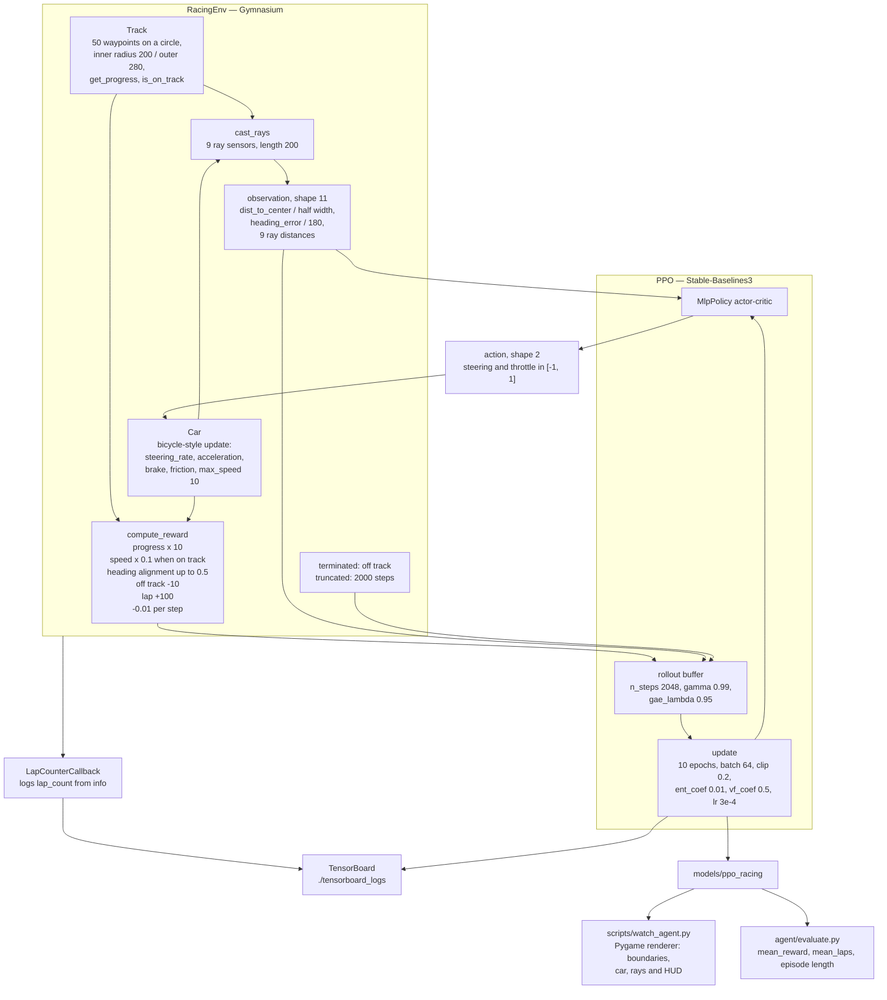
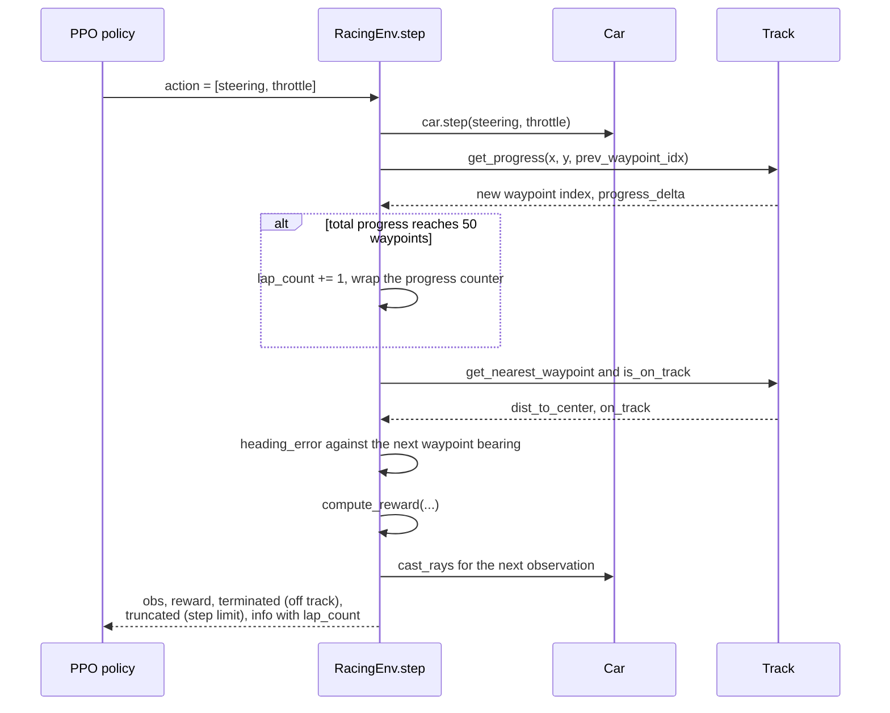

# Track Racer

PPO reinforcement learning agent trained to autonomously drive a racing track using Stable-Baselines3 and a custom Gymnasium environment.

## Overview

- Custom `RacingEnv` (Gymnasium-compliant) with circular track, 9 ray sensors, bicycle-model car physics
- Shaped reward: progress along waypoints, speed bonus, heading alignment, off-track penalty, lap completion bonus
- PPO agent (MlpPolicy) with TensorBoard logging and checkpoint callbacks
- Pygame real-time renderer showing track boundaries, car, ray sensors, and HUD

## Tech Stack

Python 3.11 · Stable-Baselines3 · Gymnasium · PyTorch · Pygame · TensorBoard

## Quickstart

```bash
pip install -r requirements.txt

# Train
python scripts/train.py --env-config configs/env_config.yaml --ppo-config configs/ppo_config.yaml

# Watch a trained agent
python scripts/watch_agent.py --model-path ./models/ppo_racing --n-episodes 5

# Monitor training
tensorboard --logdir ./tensorboard_logs

# Tests
pytest tests/ -v
```

## Architecture



One environment step, in the order the code runs it:



## Evaluation

`agent/evaluate.py` rolls out a trained policy for `n_episodes` and reports:

| Metric | Description |
|--------|-------------|
| `mean_reward` | Average undiscounted episode return across rollouts |
| `mean_laps` | Average completed laps per episode (primary task-success signal) |
| Episode length | Mean steps survived; truncation indicates the agent stayed on track |

Run:

```bash
python -m agent.evaluate --model-path ./models/ppo_racing --n-episodes 50
```

Recommended additional offline diagnostics:

- **Lap completion rate**: fraction of episodes with `lap_count >= 1` (success rate).
- **Off-track termination rate**: fraction of episodes ending in the off-track penalty.
- **Mean lap time**: steps per completed lap, lower is better, indicates speed–stability trade-off.
- **Reward decomposition**: log progress / speed / alignment / penalty terms separately to
  TensorBoard to detect reward hacking.
- **Robustness sweep**: re-evaluate the same checkpoint with perturbed track radius / friction
  in `configs/env_config.yaml` to estimate generalization.

Training curves (`ep_rew_mean`, `ep_len_mean`, `policy_loss`, `value_loss`) are streamed to
`./tensorboard_logs/` and viewable via `tensorboard --logdir ./tensorboard_logs`.

## Reward Engineering

| Component | Value |
|---|---|
| Progress | +progress_delta × 10 |
| Speed | +speed × 0.1 (on-track only) |
| Heading alignment | +max(0, 1 - \|heading_err\| / 90) × 0.5 |
| Off-track penalty | −10 (terminal) |
| Lap completion | +100 |
| Time penalty | −0.01 per step |
